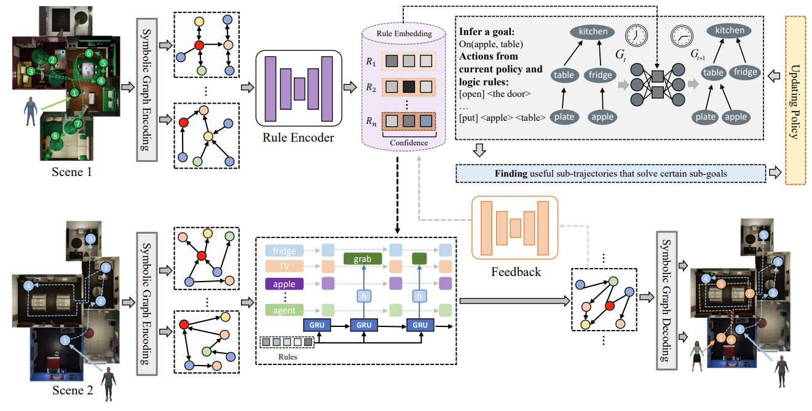
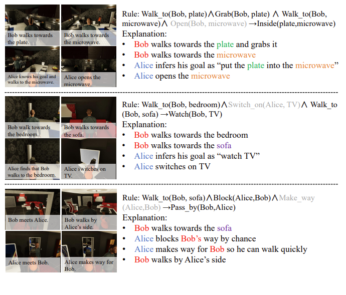

# LGR

<!--  -->
<!--  -->


This repository provides the implementation of the following paper:

> Enhancing Human-AI Collaboration Through Logic-Guided Reasoning
>
> Chengzhi Cao, Yinghao Fu*, Sheng Xu, Ruimao Zhang, Shuang Li
>
> International Conference on Learning Representations
>
> Paper Link:
>
> We present a systematic framework designed to enhance human-robot perception and collaboration through the integration of logical rules and Theory of Mind (ToM). Logical rules provide interpretable predictions and generalize well across diverse tasks, making them valuable for learning and decision-making. Leveraging the ToM for understanding others' mental states, our approach facilitates effective collaboration. In this paper, we employ logic rules derived from observational data to infer human goals and guide human-like agents. These rules are treated as latent variables, and a rule encoder is trained alongside a multi-agent system in the robot's mind. We assess the posterior distribution of latent rules using learned embeddings, representing entities and relations. Confidence scores for each rule indicate their consistency with observed data. Then, we employ a hierarchical reinforcement learning model with ToM to plan robot actions for assisting humans. Extensive experiments validate each component of our framework, and results on multiple benchmarks demonstrate that our model outperforms the majority of existing approaches.


## Dependencies

- dgl==0.5.2
- gym==0.17.3
- hiredis==1.1.0
- idna==2.8
- importlib-metadata==2.0.0
- ipdb==0.13.4
- ipython==7.18.1
- matplotlib==3.3.2
- numpy
- opencv-python==4.0.0.21
- Pillow
- PyYAML>=5.4
- ray==1.0.0
- scipy==1.5.2
- torch==1.6.0
- torchvision==0.7.0
- tqdm==4.31.1


## Setup
Clone the [VirtualHome API](https://github.com/xavierpuigf/virtualhome.git) repository one folder above this repository

```bash
git clone --branch wah https://github.com/xavierpuigf/virtualhome.git
```

Download the simulator, and put it in an `executable` folder, one folder above this repository


- [Download](http://virtual-home.org/release/simulator/v2.0/linux_exec.zip) Linux x86-64 version.
- [Download](http://virtual-home.org/release/simulator/v2.0/macos_exec.zip) Mac OS X version.
- [Download](http://virtual-home.org/release/simulator/v2.0/windows_exec.zip) Windows version.

### Install Requirements
```bash
pip install -r requirements.txt
```

## Dataset


We can download *train* and *test* datasets used in [google drive](https://drive.google.com/drive/folders/12QWa6cQKlC6SksU9uj7HCSVr4V6i6n86?usp=drive_link), and put it on "/dataset" file.

### Generate dataset 
You can also create your dataset:

```bash
python gen_data/vh_init.py --num-per-apartment {NUM_APT} --task {TASK_NAME}
```
Where `NUM_APT` corresponds to the number of episodes you want for each apartment and task and `TASK_NAME` corresponds to the task name you want to generate, which can be `setup_table`, `clean_table`, `put_fridge`, `prepare_food`, `read_book`, `watch_tv` or `all` to generate all the tasks.

### Logic base

We follow [Logic_Point_Processes](https://github.com/FengMingquan-sjtu/Logic_Point_Processes_ICLR) to prepare the data. The logic rules contain temporal relations and spatial relations.

```
python gen_data/logic.py
```
dataset_id denotes the index of dataset. You can design specific predicates and relation types based on the dataset you are using.


## Training

You can train the goal prediction model as follows:

```bash
python model.py
```

The code of our algorithm will come soon.


## Visualization




## Contact
Should you have any question, please contact chengzhicao@mail.ustc.edu.cn.

## Notes and references
The  code is based on the paper 'Watch-And-Help: A Challenge for Social Perception and Human-AI Collaboration'(https://github.com/xavierpuigf/watch_and_help/tree/main)

[1] [Li S, Feng M, Wang L, et al. Explaining point processes by learning interpretable temporal logic rules[C]//International Conference on Learning Representations. 2021.](https://openreview.net/pdf?id=P07dq7iSAGr) <br />
[2] [Li S, Wang L, Zhang R, et al. Temporal logic point processes[C]//International Conference on Machine Learning. PMLR, 2020: 5990-6000.](https://proceedings.mlr.press/v119/li20p/li20p.pdf) <br />
